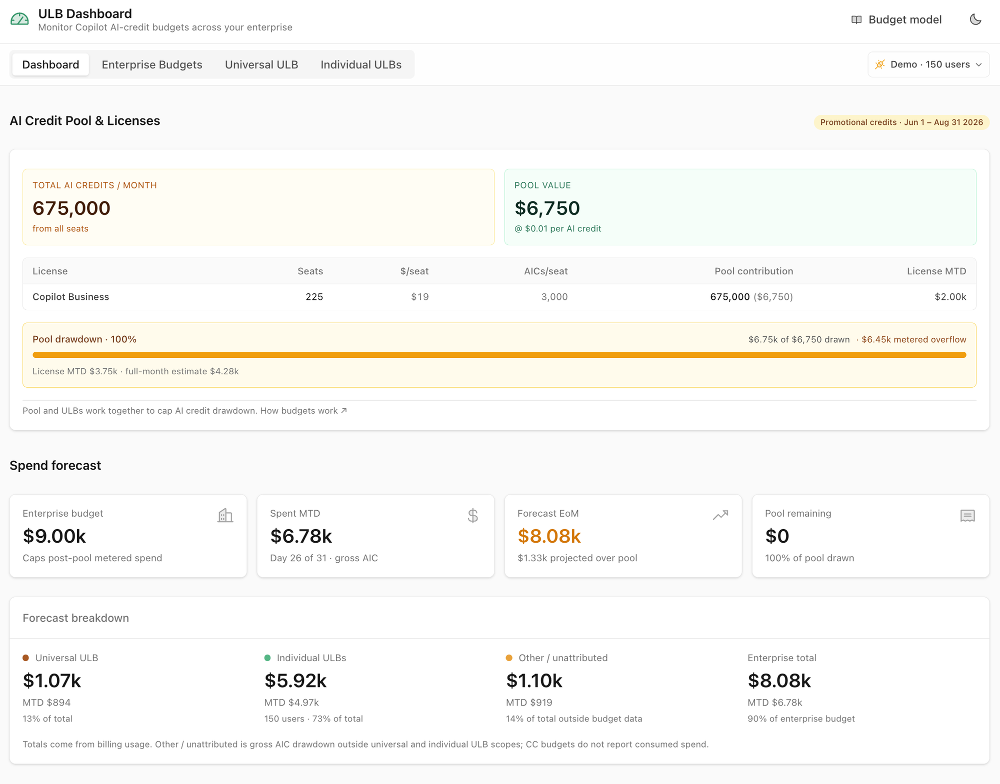
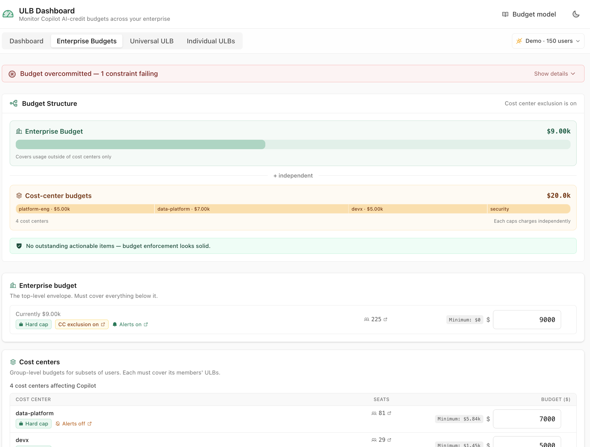
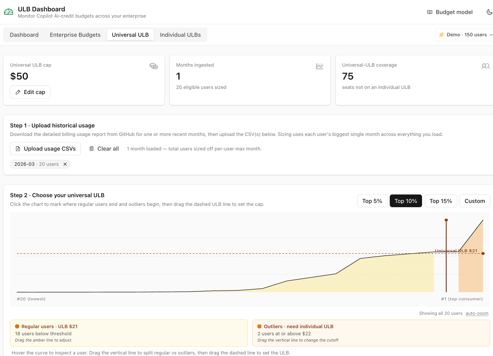
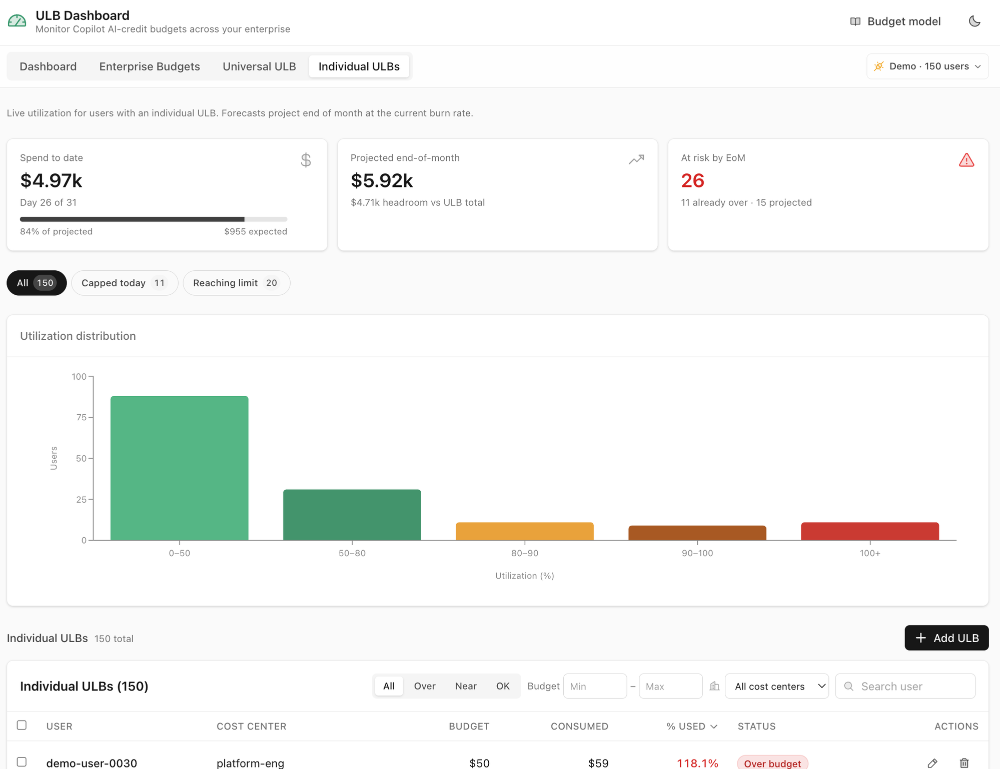
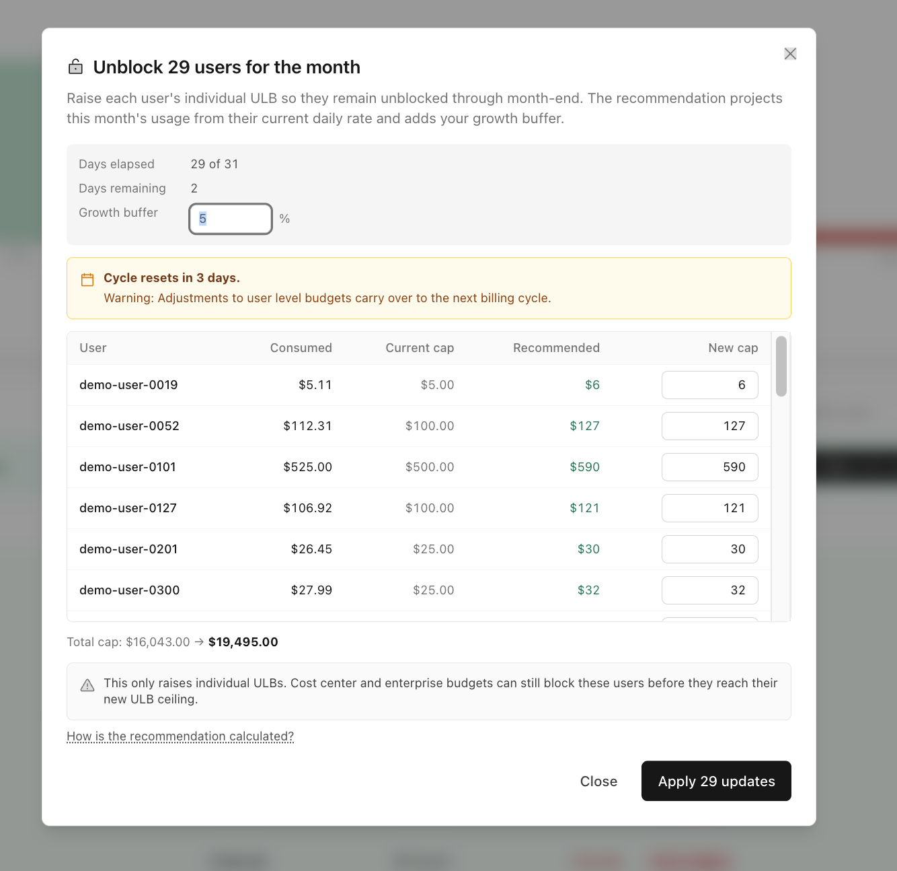

# UBB Dashboard

**Monitor and manage GitHub Copilot AI-credit budgets across your enterprise — from the pool down to a single user.**

_A single browser tab to see your enterprise budget, size a universal UBB from real usage, manage individual UBBs at scale, and unblock thousands of users in one click. No backend._

[](LICENSE)
[](https://react.dev)
[](https://vitejs.dev)
[](https://tailwindcss.com)
[](#run-with-docker)

### 🌐 [**Open the app → xrvk.github.io/ubb-dashboard**](https://xrvk.github.io/ubb-dashboard/)

_Runs entirely in your browser. Your enterprise URL and PAT stay in tab memory — never sent anywhere except the GitHub API host you connect to. See [Security](#-security--token-handling)._

[Open the app](https://xrvk.github.io/ubb-dashboard/) · [Features](#-features) · [Quick start](#-quick-start) · [Connect your enterprise](#-connect-your-enterprise) · [How it works](#-how-it-works) · [Security](#-security--token-handling)

---

> [!IMPORTANT]
> **Disclaimer:** This tool is an independent, personal project built by a GitHub Solutions Engineer to help customers and the broader community manage GitHub Copilot user-level budgets (UBBs). It is **not** an official GitHub product, does not represent GitHub's views, and is not endorsed or supported by GitHub.
>
> Spend forecasts and the "Unblock for the month" projection are best-effort recommendations based on the daily spend rate observed so far this billing cycle. **Past usage patterns may not predict future usage.** GitHub may change pricing, credit allocations, or billing mechanics at any time. Always verify recommendations against [GitHub's official documentation](https://docs.github.com/en/copilot/managing-copilot/managing-github-copilot-in-your-organization/managing-the-spending-policy-for-github-copilot-in-your-organization) and your own billing data before applying changes.

> [!NOTE]
> **No GitHub Enterprise?** This dashboard targets the **enterprise** billing API and needs an enterprise slug + `manage_billing:enterprise` PAT scope. If you're on a standalone GitHub organization (no enterprise above it), use the org variant instead: **[xrvk/ubb-dashboard-org](https://github.com/xrvk/ubb-dashboard-org)**.

---

## 📸 Screenshots

| Dashboard | Enterprise Budgets |
|:-:|:-:|
| [](docs/dashboard-overview.png) | [](docs/enterprise-budgets.png) |
| Pool drawdown, licenses, and end-of-month spend forecast | Hierarchy view with hard-cap validation across enterprise + cost centers |

| Universal UBB | Individual UBBs |
|:-:|:-:|
| [](docs/universal-ubb.png) | [](docs/individual-ubbs.png) |
| Size your universal cap from real CSV usage using a Top 5/10/15% cutoff | Utilization histogram, status badges, and bulk-unblock at scale |

---

## 🎯 Why this exists

GitHub Copilot's usage-based billing gives enterprise admins **four layered controls**: the prepaid AI-credit pool from your seats, an enterprise spending limit, optional cost-center budgets, and per-user budgets (a single **universal UBB** plus per-user **individual UBBs**). Each layer is configurable in the native UI, but operating them together at scale is hard:

- The native UI shows one budget at a time. There is no single view of the pool, the enterprise envelope, the cost centers, and every per-user cap.
- There is no built-in spend forecast — you can see consumed-to-date but not projected end-of-month.
- There is no recommended size for the universal UBB. You guess, or you write a script to pull billing CSVs and compute the distribution yourself.
- There is no "who's over?" view for individual UBBs, and no bulk way to raise caps when a sprint pushes hundreds of users over their per-user limit.
- The API works, but you have to write the script, handle pagination, handle 429s, snapshot before/after for rollback, and survive a single failure.

This app puts the whole budget hierarchy on one screen, **forecasts** spend, **sizes** the universal cap from your real usage, and **bulk-edits** individual UBBs with rate-limit-aware batching so you can safely apply 5,000+ updates from your browser.

---

## ✨ Features

| 📊 See | 🧮 Plan | 🚀 Apply at scale |
|:--|:--|:--|
| Pool drawdown vs. license contribution | Universal-UBB sizing from CSV usage | Multi-select with cross-page "select all matching" |
| End-of-month spend forecast | Top 5 / 10 / 15 / Custom cutoff presets | "Unblock N users for the month" bulk dialog |
| Forecast breakdown by Universal / Individual / Other | Enterprise + cost-center budget hierarchy | Projection math with per-row override |
| Utilization histogram with 5 buckets | Hard-cap validation across the hierarchy | Live progress bar, ETA, and cancel |
| Click-to-filter cards, chart bars, and table | Cost-center attribution per Copilot user | Rate-limit-aware: bounded concurrency + 429 retry |
| Sortable, paginated table with search & filters | Editable caps with min / max guardrails | Snapshot + revert + JSON export/import |

The app is organized into **four tabs**, each focused on one layer of the budget hierarchy:

<details>
<summary><b>Dashboard</b> — pool drawdown, licenses, and spend forecast</summary>


Top-of-funnel view of where your Copilot money is going **right now**:

- **AI Credit Pool & Licenses** — total AI credits per month, pool value at $0.01/credit, license-by-license breakdown of seats, $/seat, AICs/seat, and pool contribution. Promotional credit windows are surfaced inline.
- **Pool drawdown** — animated bar showing how much of the pool has been consumed, with metered overflow above the pool callout.
- **Spend forecast** — four-card row covering enterprise budget cap, spent month-to-date, projected end-of-month, and pool remaining.
- **Forecast breakdown** — splits projected spend into Universal UBB, Individual UBBs, and Other/Unattributed so you can see where overflow is coming from.

</details>

<details>
<summary><b>Enterprise Budgets</b> — hierarchy, hard caps, and constraint validation</summary>


A single editor for every budget layer that lives **above** individual UBBs:

- **Budget structure diagram** at the top — visualizes the enterprise envelope and cost-center budgets, with the cost-center exclusion toggle surfaced inline.
- **Enterprise budget** — the top-level envelope, with hard-cap enforcement and minimum value derived from the layers below it.
- **Cost centers** — group-level budgets for subsets of users, each with seat count, hard-cap, and an alert-status badge.
- **Constraint banner** at the top warns when any layer is overcommitted (e.g. cost-center budgets exceed the enterprise cap) and explains which constraint is failing.

Edits are pushed via PATCH against the GitHub billing API. Drift on **Exclude cost centers** and **Stop usage** is detected and surfaced.

</details>

<details>
<summary><b>Universal UBB</b> — size your universal cap from real usage</summary>


Pick the right universal UBB without guessing. Upload one or more months of detailed billing usage CSVs (exported from GitHub) and the app:

1. **Sizes each user off their biggest single month** across everything you loaded.
2. **Plots the consumption curve** — sorted users on the X axis, AI-credit spend on the Y axis.
3. **Recommends a split** between regular users (covered by the universal UBB) and outliers (who need an individual UBB) using Top 5%, Top 10%, Top 15%, or Custom cutoffs.
4. **Lets you drag** the vertical cutoff line and the horizontal UBB line directly on the chart to fine-tune the recommendation.

A coverage card shows how many seats are **not** on an individual UBB and therefore fall under the universal cap. Edits to the cap apply with one click.

</details>

<details>
<summary><b>Individual UBBs</b> — live utilization and bulk-unblock at scale</summary>


Per-user UBB management at enterprise scale:

- **Spend cards** — spend-to-date with day-of-cycle progress, projected end-of-month with headroom vs. total, and an at-risk count with already-over breakdown.
- **Utilization histogram** — 5 buckets (0–50% / 50–80% / 80–90% / 90–100% / 100%+) that click-filter the table below.
- **Searchable, sortable, paginated table** with status badges, cost-center column, budget min/max range filter, and over/near/ok quick filters.
- **Add UBB** with searchable Copilot-seat autocomplete. Existing-UBB users are disabled in the picker.
- **Single-row edit / delete** dialogs, always enforcing `prevent_further_usage: true`.
- **Bulk unblock** dialog — see below.

### Cost center attribution

Each user row shows the cost center their Copilot usage is charged to, with a dropdown filter for any active CC or **Unassigned** (enterprise default). Resolution follows the [cost-center allocation rules](https://docs.github.com/en/billing/reference/cost-center-allocation):

1. The CC that lists the **user** as a direct resource wins.
2. Otherwise, the CC that lists the **org that granted the user's Copilot license** wins (shown with a "via org" badge).
3. Otherwise, the user is shown as **Unassigned**.

If the connected PAT lacks `manage_billing:enterprise` read scope, the cost-center column and filter hide gracefully — the rest of the dashboard keeps working.

### Status & utilization

Each user is classified by `consumed_amount ÷ budget_amount`:

| Bucket | Meaning | Color |
|:-:|---|:-:|
| 0–50% | Low utilization | 🟢 emerald |
| 50–80% | Moderate | 🟢 green |
| 80–90% | Getting close | 🟡 amber |
| 90–100% | About to block | 🟠 orange |
| 100%+ | Blocked / over | 🔴 red |

### Unblock for the month



Select any number of users (within a filter or across all matching pages) and run a guided bulk-update:

- Recommended new cap = `consumed_so_far + (consumed_so_far / days_elapsed) × days_remaining` × `(1 + growth_buffer)`, rounded up to whole dollars.
- Default 5% growth buffer, fully editable.
- Per-row override input if you want to deviate from the recommendation.
- "Low confidence" tag on users where fewer than 5 days have elapsed.
- An expandable **How is the recommendation calculated?** explainer.
- Late-cycle warning when the billing cycle is 7 days or fewer from resetting.

### Snapshot, revert, JSON export/import

Every successful bulk apply records a snapshot of the previous caps, persisted in `localStorage` per enterprise.

- **Auto-downloaded JSON** of the snapshot at apply time, so you have an off-browser copy.
- **"Revert (N)"** button in the header opens a row-by-row preview and restores the previous values via batch `PATCH`.
- **"Import snapshot"** accepts a JSON file (validated against the connected enterprise) so you can revert from a different machine or after `localStorage` was cleared.
- **"Download JSON"** in the Revert dialog lets you re-export the current snapshot at any time.

This solves the mid-cycle persistence footgun: `budget_amount` survives cycle resets even though `consumed_amount` zeroes out, so a late-cycle bump silently becomes next month's baseline. With the snapshot, rolling back is a one-click action.

### Scale & rate limits

GitHub classic PATs are capped at 5,000 requests/hour (primary) with a stricter secondary "abuse detection" limit on rapid bursts. The bulk-apply runner:

- Caps concurrency at 5 in-flight requests.
- Adds a small inter-task delay to stay below abuse detection.
- Parses `Retry-After` from response headers first (falls back to body, then a 60s default), retries up to 2 times per task on 429.
- Retries transient 5xx and network errors with bounded exponential backoff + jitter, separately from 429.
- Supports cancellation mid-batch via `AbortSignal`.
- Surfaces live progress (completed / succeeded / failed / waiting), elapsed time, and ETA.
- Pre-flight warning when the batch exceeds 5,000 (will hit the primary cap).

You can confidently run a 9,800-user unblock without thinking about it.

### Error handling

The dashboard treats errors as first-class UX, not just toast spam:

- **Typed taxonomy** — every API failure becomes one of `AuthError` (401), `ScopeError` (403), `NotFoundError` (404), `ValidationError` (422), `RateLimitError` (429), `ServerError` (5xx), `NetworkError` (fetch reject), or `AbortedError`. The UI maps each to a short, actionable message instead of dumping raw JSON.
- **Partial-load banner** — if a secondary fetch (cost centers, seats, usage summary) fails during connect, the page still renders with a collapsible amber banner explaining what's missing and why (e.g. "PAT lacks `manage_billing:enterprise` scope") instead of showing an empty cost-center column with no explanation.
- **Failed-items dialog** — when a bulk update finishes with failures, you see a per-user list with status code and reason. "Retry failures" re-runs only the failed subset; "Export CSV" downloads the list for triage.
- **Snapshot warnings** — after a bulk apply finishes, if `localStorage` is full when we try to persist the pre-/post-values, you're warned that the revert button will not be available for this batch (you can still re-run the bulk apply with the inverse values manually).
- **Error boundary** — render-time exceptions in one tab collapse to a small "Try again / Copy error details" card instead of white-screening the entire app and losing your credentials.
- **Debug log** — the last ~100 errors are kept in an in-memory ring buffer. The "Copy error log" link in the footer copies a structured bundle (status codes, response excerpts, captured headers — never the token) for bug reports.

</details>

---

## 🚀 Quick start

The fastest way to try the app is the **hosted version** — no install required:

> 🌐 **[xrvk.github.io/ubb-dashboard](https://xrvk.github.io/ubb-dashboard/)**

Prefer to run it yourself? See **[`docs/self-hosting.md`](./docs/self-hosting.md)** for Docker, local clone, env profiles, and the API endpoints the app calls.

### Try without an enterprise

The app ships with a synthetic-data mode for trying the UI at scale:

| URL | What it does |
|---|---|
| http://localhost:5003/?demo=50 | Small, realistic enterprise |
| http://localhost:5003/?demo=900 | Mid-size: paginated table, full histogram |
| http://localhost:5003/?demo=9800 | Stress test: rate-limit pre-flight, progress UI |

Demo mode generates believable user distributions (~70% low / 15% moderate / 7% getting close / 5% about to block / 3% over) and stubs all writes with toast notifications so you can click around without consequence.

---

## 🔌 Connect your enterprise

The Import panel needs two things:

1. **Enterprise URL** — e.g. `https://github.com/enterprises/your-slug` or `https://your-host.ghe.com/enterprises/your-slug`.
2. **Classic personal access token** with the `manage_billing:enterprise` scope.

> Fine-grained tokens are **not** supported on the enterprise billing API. This is a platform limitation, not an app limitation.
>
> Don't have a GitHub Enterprise? Use the org-scoped variant: **[xrvk/ubb-dashboard-org](https://github.com/xrvk/ubb-dashboard-org)**.

On connect, the app fetches every budget and every Copilot seat in your enterprise (both are paginated up to the platform's ~10,000 budget cap and seat count). It does this once on connect and again per Refresh.

### Pre-fill the enterprise URL via a shareable link

The easiest way to generate one of these links is from inside the app: connect to your enterprise, open the connection menu in the top-right, and choose **Copy shareable link**. The result pre-fills the Enterprise URL field on the connect screen for the recipient — they still need to paste their own PAT, since credentials are never in the URL.

Manual construction works too:

**github.com:**

```
https://xrvk.github.io/ubb-dashboard/?ent=acme-corp
```

**GHE.com (data residency tenants):** use the full URL form so the link routes to the right host.

```
https://xrvk.github.io/ubb-dashboard/?ent=https://acme.ghe.com/enterprises/acme-corp
```

See [`docs/url-parameters.md`](./docs/url-parameters.md) for the full list of supported parameters (most are for development and testing), and [`docs/self-hosting.md`](./docs/self-hosting.md#api-endpoints) for the underlying API endpoints the app calls.

---

## 🛠 How it works

- **No backend.** The whole app is static JS/CSS. Fetches go directly from your browser to your enterprise's API host.
- **Credentials live in React state only.** Disconnecting or closing the tab forgets them.
- **State-during-render** for prop→state syncs (no `useEffect` for derived state); state lifted to `App` for shared filters between the cards, chart, and table.
- **Pure helpers** in `src/lib/` for projection math, status classification, pool/spend math, budget-constraint validation, and the batch runner — all covered by Vitest unit tests.

### Project layout

```
src/
├── App.tsx                         # Layout, tab routing, state, dialog orchestration
├── main.tsx                        # Bootstrap (CredentialsProvider, ThemeProvider)
├── components/
│   ├── DashboardPage.tsx           # Pool drawdown, licenses, spend forecast
│   ├── ForecastHero.tsx            # MTD / EoM / pool remaining cards
│   ├── BudgetPlanner.tsx           # Enterprise Budgets tab
│   ├── BudgetStructureDiagram.tsx  # Hierarchy visualization
│   ├── ConstraintsBanner.tsx       # Overcommit warning
│   ├── UniversalUbbPage.tsx        # CSV upload + consumption curve
│   ├── ConsumptionCurve.tsx        # Draggable cutoff & UBB lines
│   ├── EditUniversalUbbDialog.tsx
│   ├── IndividualUbbPage.tsx       # Per-user table + histogram
│   ├── IndividualUbbTaskBanner.tsx
│   ├── BudgetsTable.tsx            # Sortable, filterable, paginated, multi-select
│   ├── UtilizationHistogram.tsx
│   ├── BulkUnblockDialog.tsx       # Projection, progress UI, cancel
│   ├── RevertBulkDialog.tsx        # Snapshot-driven rollback
│   ├── CreateBudgetDialog.tsx
│   ├── EditBudgetDialog.tsx
│   ├── DeleteConfirmDialog.tsx
│   ├── ImportPanel.tsx
│   └── ui/                         # Button, Card, Dialog, Input, StatusBadge, UserCombobox
├── hooks/
│   ├── use-credentials.tsx         # Connect / disconnect / refresh, demo-mode plumbing
│   └── use-budget-constraints.ts   # Cross-layer validation
└── lib/
    ├── api.ts                      # Typed wrappers + paginated fetchers
    ├── batch.ts                    # Rate-limit-aware bulk runner
    ├── budgetConstraints.ts        # Hierarchy validation
    ├── budgetAutoFix.ts            # Suggested fixes for overcommit
    ├── consumptionAnalysis.ts      # CSV usage → distribution
    ├── poolSplit.ts                # Universal vs. individual coverage math
    ├── usageReport.ts              # CSV parser
    ├── reportCache.ts              # Persisted CSV state per enterprise
    ├── demo.ts                     # Synthetic enterprise generator
    ├── projection.ts               # Unblock-for-month math
    ├── snapshot.ts                 # Snapshot save / load / export / import
    ├── status.ts                   # over/near/ok classification
    └── utils.ts                    # cn(), formatCurrency, formatPercent
```

See [`docs/self-hosting.md#npm-scripts`](./docs/self-hosting.md#npm-scripts) for the full list of `npm` scripts (dev, build, typecheck, lint, test, verify).

---

## 🔒 Security & token handling

- **Credentials never leave the browser** except as the `Authorization` header on requests to your enterprise's API host.
- **Nothing is persisted.** Not localStorage, not sessionStorage, not cookies. Reload = re-enter. (CSV usage data and bulk-apply snapshots _are_ persisted in `localStorage` per-enterprise, but never the token.)
- **No analytics, no telemetry, no third-party scripts.** Open Network → DevTools to verify.
- **No remote logging.** Errors stay in your console.

The token only needs `manage_billing:enterprise` on a classic PAT.

For vulnerability reports, see [SECURITY.md](SECURITY.md).

---

## 📜 License

MIT — see [LICENSE](LICENSE).

## 🙋 Support

This project is maintained by a sole GitHub Solutions Engineer on a best-effort basis. See [SUPPORT.md](SUPPORT.md). It is **not** an officially supported GitHub product.

---

Developed by [@xrvk](https://github.com/xrvk).
